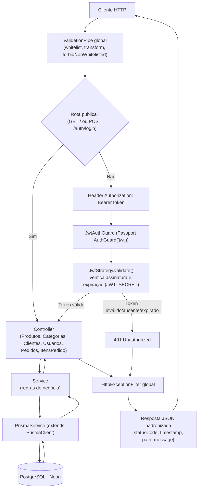
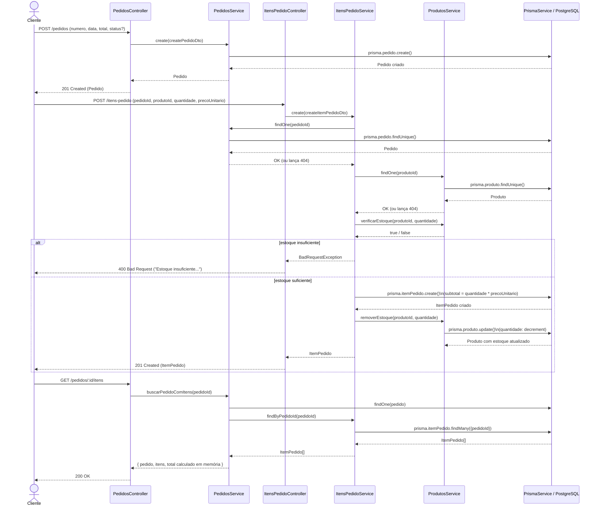

# Documentação Técnica da API — ATRIA ERP Backend

> Documentação gerada a partir da leitura direta do código-fonte do projeto (NestJS 11 + Prisma 7 + PostgreSQL). Nenhuma suposição foi feita sobre comportamento não presente no código.

**Stack principal:** NestJS 11, Prisma ORM 7 (`@prisma/client` + `@prisma/adapter-pg`), PostgreSQL (hospedado na Neon), Passport + `passport-jwt`, `class-validator`/`class-transformer`, Joi (validação de variáveis de ambiente), `@nestjs/swagger`.

---

## Sumário

1. [Arquitetura da API](#arquitetura-da-api)
2. [Autenticação](#módulo-auth)
3. [Rota raiz](#módulo-app)
4. [Produtos](#módulo-produtos)
5. [Categorias](#módulo-categorias)
6. [Clientes](#módulo-clientes)
7. [Usuários](#módulo-usuarios)
8. [Pedidos](#módulo-pedidos)
9. [Itens de Pedido](#módulo-itens-pedido)
10. [Tabela resumo de todas as rotas](#tabela-resumo)
11. [Fluxograma geral da arquitetura](#fluxograma-geral-da-arquitetura)
12. [Fluxograma: criação de pedido, itens e controle de estoque](#fluxograma-criação-de-pedido-com-itens-e-atualização-de-estoque)

---

## Arquitetura da API

### Estrutura de pastas

```
src/
├── app.controller.ts / app.service.ts / app.module.ts   # módulo raiz
├── main.ts                                               # bootstrap (ValidationPipe, Filter, Swagger)
├── common/
│   └── filters/http-exception.filter.ts                  # Exception Filter global
├── prisma/
│   ├── prisma.service.ts                                 # extends PrismaClient, gerencia conexão (pg Pool + adapter)
│   └── prisma.module.ts                                  # módulo global, exporta PrismaService
├── auth/
│   ├── auth.controller.ts / auth.service.ts / auth.module.ts
│   ├── dto/login.dto.ts
│   ├── entities/auth-token.entity.ts
│   ├── interfaces/ (jwt-payload, usuario-autenticado)
│   ├── strategies/jwt.strategy.ts                        # Passport Strategy ('jwt')
│   └── guards/jwt-auth.guard.ts                           # AuthGuard('jwt')
├── produtos/        (controller, service, module, dto, entity)
├── categorias/      (controller, service, module, dto, entity)
├── clientes/        (controller, service, module, dto, entity)
├── usuarios/        (controller, service, module, dto, entity, enum PerfilUsuario)
├── pedidos/         (controller, service, module, dto, entities, enum StatusPedido)
└── itens-pedido/    (controller, service, module, dto, entity)

prisma/schema.prisma  # modelos: Usuario, Cliente, Categoria, Produto, Pedido, ItemPedido
generated/prisma/     # cliente Prisma gerado
```

### Função de cada módulo

| Módulo | Responsabilidade |
|---|---|
| `PrismaModule` | Módulo **global** (`@Global()`), fornece `PrismaService` (instância única de `PrismaClient` conectada via `@prisma/adapter-pg`) para toda a aplicação. |
| `AuthModule` | Login e emissão de JWT. Importa `UsuariosModule` (para buscar usuário por e-mail), `PassportModule` e `JwtModule` (configurado via `ConfigService` com `JWT_SECRET`/`JWT_EXPIRES_IN`). |
| `ProdutosModule` | CRUD de produtos + regras de estoque (`verificarEstoque`, `removerEstoque`, `adicionarEstoque`), consumidas pelo módulo de Itens de Pedido. |
| `CategoriasModule` | CRUD de categorias. Não possui relacionamento com `Produto` no schema atual (campo de categoria não existe no modelo `Produto`). |
| `ClientesModule` | CRUD de clientes. Sem relacionamento formal com `Pedido` no schema atual (o modelo `Pedido` não possui `clienteId`). |
| `UsuariosModule` | CRUD de usuários do sistema (login, perfil, senha com hash `bcrypt`). Usado pelo `AuthModule` para autenticação. |
| `PedidosModule` | CRUD de pedidos + agregação de itens (`buscarPedidoComItens`, `calcularTotalPedido`). Importa `ItensPedidoModule` com `forwardRef` (dependência circular). |
| `ItensPedidoModule` | CRUD de itens de pedido; é o módulo que **efetivamente movimenta o estoque** ao criar/atualizar/remover itens. Importa `PedidosModule` (`forwardRef`) e `ProdutosModule`. |
| `common/filters` | `HttpExceptionFilter`, aplicado globalmente em `main.ts`, padroniza todas as respostas de erro. |

### Como Controllers, Services, Prisma e PostgreSQL se relacionam

Todos os módulos seguem o mesmo padrão em camadas:

```
Controller → Service → PrismaService (extends PrismaClient) → PostgreSQL (Neon)
```

- **Controller**: recebe a requisição HTTP, aplica `@UseGuards(JwtAuthGuard)` (exceto `AppController` e `AuthController`), valida o corpo via `ValidationPipe` global (`whitelist`, `transform`, `forbidNonWhitelisted`) e delega ao Service.
- **Service**: contém a lógica de negócio (validação de existência via `findOne`/`localizar`, regras de estoque, hashing de senha, cálculo de subtotal/total) e chama o `PrismaService` para acessar o banco.
- **PrismaService** (`src/prisma/prisma.service.ts`): estende `PrismaClient`, usa `PrismaPg` (adapter) sobre um `pg.Pool` configurado com `DATABASE_URL`. Implementa `OnModuleInit`/`OnModuleDestroy` para conectar/desconectar o pool junto ao ciclo de vida da aplicação Nest. É fornecido globalmente (`@Global()`), então nenhum módulo de domínio precisa importá-lo explicitamente.
- **PostgreSQL (Neon)**: banco relacional acessado exclusivamente através do Prisma Client gerado em `generated/prisma`.

### Como funciona o fluxo de autenticação JWT

1. O cliente chama `POST /auth/login` com `email`/`senha` (`LoginDto`, validado pelo `ValidationPipe`).
2. `AuthController.login()` delega a `AuthService.login()`.
3. `AuthService` busca o usuário via `UsuariosService.buscarPorEmail()` (Prisma). Se não existir → `UnauthorizedException('Credenciais inválidas')`.
4. A senha informada é comparada com o hash armazenado via `bcrypt.compare()`. Se inválida → mesma exceção.
5. Se válida, monta um `JwtPayload` (`{ sub, email, perfil }`) e assina com `JwtService.sign()`, usando `JWT_SECRET`/`JWT_EXPIRES_IN` (validados na inicialização via Joi em `app.module.ts`).
6. Retorna `{ access_token }` (200 OK, `AuthToken`).
7. Em requisições subsequentes a rotas protegidas, o cliente envia `Authorization: Bearer <token>`.
8. `JwtAuthGuard` (extensão de `AuthGuard('jwt')` do Passport) intercepta a requisição e delega a validação à `JwtStrategy`, que extrai o token do header (`ExtractJwt.fromAuthHeaderAsBearerToken`), valida assinatura/expiração contra `JWT_SECRET`, e — se válido — chama `validate(payload)`, retornando um `UsuarioAutenticado` (`{ id, email, perfil }`) que é anexado a `request.user`.
9. Se o token estiver ausente, inválido ou expirado, o Guard barra a requisição com `401 Unauthorized` **antes** de o Controller ser executado.

> **Importante:** o payload do JWT carrega o campo `perfil` (`PerfilUsuario`: `ADMIN`, `VENDEDOR`, `CLIENTE`), e o `UsuarioAutenticado` também o expõe, mas **não existe nenhum Guard, Decorator (`@Roles`) ou verificação de perfil em nenhum Controller/Service** no código atual. Ou seja, **não há RBAC implementado** — qualquer usuário autenticado (independente do perfil) pode acessar qualquer rota protegida.

### Como funciona a proteção das rotas

A proteção é feita **no nível do Controller**, com o decorator `@UseGuards(JwtAuthGuard)` aplicado à classe inteira (não rota a rota):

| Controller | Protegido por `JwtAuthGuard`? |
|---|---|
| `AppController` (`GET /`) | ❌ Não |
| `AuthController` (`POST /auth/login`) | ❌ Não (rota pública, requisito de negócio) |
| `ProdutosController` | ✅ Sim (todas as rotas) |
| `CategoriasController` | ✅ Sim (todas as rotas) |
| `ClientesController` | ✅ Sim (todas as rotas) |
| `UsuariosController` | ✅ Sim (todas as rotas) |
| `PedidosController` | ✅ Sim (todas as rotas) |
| `ItensPedidoController` | ✅ Sim (todas as rotas) |

Quando o Guard barra uma requisição, a resposta passa pelo `HttpExceptionFilter` global e é padronizada como:
```json
{
  "statusCode": 401,
  "timestamp": "2026-07-29T12:00:00.000Z",
  "path": "/produtos",
  "message": "Unauthorized"
}
```

### Como funciona o controle de estoque

O controle de estoque **não** está no `ProdutosController`/`ProdutosService` de forma isolada — ele é orquestrado pelo `ItensPedidoService`, que consome três métodos do `ProdutosService`:

- `verificarEstoque(produtoId, quantidade)`: retorna `true`/`false` comparando `produto.quantidade >= quantidade`.
- `removerEstoque(produtoId, quantidade)`: decrementa `produto.quantidade` (`prisma.produto.update({ data: { quantidade: { decrement } } })`); lança `BadRequestException` se a quantidade solicitada for maior que o estoque disponível.
- `adicionarEstoque(produtoId, quantidade)`: incrementa `produto.quantidade` (`increment`).

Esses métodos são acionados em três momentos do ciclo de vida de um `ItemPedido`:

1. **Criação (`POST /itens-pedido`)**: verifica estoque suficiente → cria o item (`subtotal = quantidade * precoUnitario`) → **remove** a quantidade do estoque do produto.
2. **Atualização (`PUT /itens-pedido/:id`)**:
   - Se o `produtoId` mudou: devolve (`adicionarEstoque`) a quantidade antiga ao produto antigo e remove (`removerEstoque`) a nova quantidade do novo produto (validando estoque antes).
   - Se apenas a `quantidade` mudou (mesmo produto): calcula a diferença — se aumentou, verifica e remove a diferença do estoque; se diminuiu, devolve a diferença ao estoque.
   - Recalcula `subtotal` com o `precoUnitario` final (novo ou existente).
3. **Remoção (`DELETE /itens-pedido/:id`)**: devolve (`adicionarEstoque`) a quantidade do item ao estoque do produto antes de excluir o registro.

> **Observação importante:** o modelo `ItemPedido` possui `onDelete: Cascade` na relação com `Pedido` no `schema.prisma`. Isso significa que, ao excluir um Pedido diretamente (`DELETE /pedidos/:id`), o banco de dados apaga em cascata todos os `ItemPedido` vinculados **sem passar pelo `ItensPedidoService.remove()`** — ou seja, **o estoque dos produtos associados não é devolvido automaticamente** nesse cenário, pois a lógica de devolução de estoque só existe no método `remove()` do serviço de itens, não em um hook/trigger de banco.

> **Observação:** o campo `total` do `Pedido` **não é recalculado automaticamente** quando itens são adicionados/alterados/removidos — ele é definido manualmente no `CreatePedidoDto`/`UpdatePedidoDto`. Já o endpoint `GET /pedidos/:id/itens` (`buscarPedidoComItens`) calcula um `total` **em tempo real** somando os `subtotal` de todos os itens do pedido — esse total calculado pode divergir do campo `total` persistido na tabela `Pedido`.

### Relacionamento entre as entidades

Definido em `prisma/schema.prisma`:

- **Produto** `1 —— N` **ItemPedido** (`produtoId`, `onDelete: Restrict` — não é possível excluir um Produto que tenha itens de pedido vinculados).
- **Pedido** `1 —— N` **ItemPedido** (`pedidoId`, `onDelete: Cascade` — excluir um Pedido apaga seus itens automaticamente).
- **Categoria**, **Cliente** e **Usuario** são entidades **independentes** no schema atual — não possuem chave estrangeira nem relação declarada com `Produto`, `Pedido` ou entre si. Os módulos `Categorias` e `Clientes` expõem CRUDs isolados, sem vínculo formal de dados com o restante do domínio (não há campo `categoriaId` em `Produto` nem `clienteId` em `Pedido`).
- **Usuario** é usado exclusivamente pelo módulo de autenticação (login) e pelo próprio CRUD de usuários; não há relação com `Pedido` (não existe conceito de "vendedor responsável" ou "usuário que criou o pedido" no schema).

---

## Módulo `App`

### `GET /`

1. **Método HTTP:** GET
2. **Caminho completo:** `/`
3. **Controller:** `AppController`
4. **Método do Controller:** `getHello()`
5. **Service chamado:** `AppService`
6. **Método do Service:** `getHello()`
7. **O que faz:** Rota de sanity-check da aplicação; retorna uma string estática.
8. **DTO utilizado:** Nenhum
9. **Exige autenticação JWT:** ❌ Não
10. **Perfil necessário:** N/A (sem RBAC implementado)
11. **Possíveis respostas:** `200 OK` — corpo: `"Hello World!"` (texto puro)
12. **Observações:** Não acessa o banco de dados. Não possui utilidade de negócio, apenas health-check manual.

```
GET /
↓
AppController.getHello()
↓
AppService.getHello()
↓
retorna string estática ("Hello World!")
```

---

## Módulo `Auth`

### `POST /auth/login`

1. **Método HTTP:** POST
2. **Caminho completo:** `/auth/login`
3. **Controller:** `AuthController`
4. **Método do Controller:** `login()`
5. **Service chamado:** `AuthService`
6. **Método do Service:** `login()`
7. **O que faz:** Autentica um usuário por `email`/`senha` e retorna um JWT assinado (`access_token`).
8. **DTO utilizado:** `LoginDto` (`email: string` — `@IsEmail`; `senha: string` — `@IsString @IsNotEmpty`)
9. **Exige autenticação JWT:** ❌ Não — rota pública (requisito de negócio explícito)
10. **Perfil necessário:** N/A
11. **Possíveis respostas:**
    - `200 OK` — `AuthToken { access_token: string }` (`@HttpCode(HttpStatus.OK)` sobrescreve o padrão 201 do POST)
    - `400 Bad Request` — corpo inválido (`ValidationPipe`), ex.: `email` não é um e-mail válido
    - `401 Unauthorized` — `"Credenciais inválidas"` (usuário inexistente ou senha incorreta — mesma mensagem para ambos os casos, por segurança)
12. **Observações:** Internamente usa `UsuariosService.buscarPorEmail()` (consulta direta ao Prisma) e `bcrypt.compare()` para validar a senha contra o hash salvo. O payload do token inclui `sub` (id), `email` e `perfil`, mas nenhuma rota atualmente valida o `perfil`.

```
POST /auth/login
↓
AuthController.login()
↓
AuthService.login()
  ├─ UsuariosService.buscarPorEmail()  → PrismaService.usuario.findUnique()
  ├─ bcrypt.compare(senha, hash)
  └─ JwtService.sign(payload)
↓
Tabela Usuario (PostgreSQL) [somente leitura]
```

---

## Módulo `Produtos`

Controller protegido: `@UseGuards(JwtAuthGuard)` aplicado a toda a classe `ProdutosController`.

### `GET /produtos`

1. GET
2. `/produtos`
3. `ProdutosController`
4. `findAll()`
5. `ProdutosService`
6. `findAll()`
7. Lista todos os produtos cadastrados.
8. DTO: nenhum
9. JWT: ✅ obrigatório
10. Perfil: N/A (sem RBAC)
11. Respostas: `200 OK` (array de `Produto`) · `401 Unauthorized` (sem token/token inválido)
12. Observações: nenhuma paginação ou filtro implementados; retorna todos os registros da tabela `Produto`.

```
GET /produtos
↓
ProdutosController.findAll()
↓
ProdutosService.findAll()
↓
PrismaService.produto.findMany()
↓
Tabela Produto (PostgreSQL)
```

### `GET /produtos/:id`

1. GET
2. `/produtos/:id`
3. `ProdutosController`
4. `findOne(id: number)`
5. `ProdutosService`
6. `findOne(id)`
7. Busca um produto específico pelo `id`.
8. DTO: nenhum (`id` via `@Param('id', ParseIntPipe)`)
9. JWT: ✅ obrigatório
10. Perfil: N/A
11. Respostas: `200 OK` (`Produto`) · `400 Bad Request` (`id` não numérico — `ParseIntPipe`) · `401 Unauthorized` · `404 Not Found` (`"Produto com id {id} não encontrado"`)
12. Observações: —

```
GET /produtos/:id
↓
ProdutosController.findOne()
↓
ProdutosService.findOne()
↓
PrismaService.produto.findUnique()
↓
Tabela Produto (PostgreSQL)
```

### `POST /produtos`

1. POST
2. `/produtos`
3. `ProdutosController`
4. `create(createProdutoDto)`
5. `ProdutosService`
6. `create(dto)`
7. Cria um novo produto.
8. DTO: `CreateProdutoDto` (`nome: string` obrigatório; `descricao?: string` opcional; `preco: number` positivo; `quantidade: number` inteiro ≥ 0)
9. JWT: ✅ obrigatório
10. Perfil: N/A
11. Respostas: `201 Created` (`Produto`) · `400 Bad Request` (validação de DTO) · `401 Unauthorized`
12. Observações: `@HttpCode(HttpStatus.CREATED)` explícito no controller.

```
POST /produtos
↓
ProdutosController.create()
↓
ProdutosService.create()
↓
PrismaService.produto.create()
↓
Tabela Produto (PostgreSQL)
```

### `PUT /produtos/:id`

1. PUT
2. `/produtos/:id`
3. `ProdutosController`
4. `update(id, updateProdutoDto)`
5. `ProdutosService`
6. `update(id, dto)`
7. Atualiza parcialmente um produto existente.
8. DTO: `UpdateProdutoDto` (= `PartialType(CreateProdutoDto)`, todos os campos opcionais)
9. JWT: ✅ obrigatório
10. Perfil: N/A
11. Respostas: `200 OK` (`Produto`) · `400 Bad Request` · `401 Unauthorized` · `404 Not Found`
12. Observações: internamente chama `findOne(id)` primeiro (garante 404 antes do update).

```
PUT /produtos/:id
↓
ProdutosController.update()
↓
ProdutosService.update()
  ├─ findOne(id)  → PrismaService.produto.findUnique()
  └─ PrismaService.produto.update()
↓
Tabela Produto (PostgreSQL)
```

### `DELETE /produtos/:id`

1. DELETE
2. `/produtos/:id`
3. `ProdutosController`
4. `remove(id)`
5. `ProdutosService`
6. `remove(id)`
7. Remove um produto.
8. DTO: nenhum
9. JWT: ✅ obrigatório
10. Perfil: N/A
11. Respostas: `204 No Content` · `401 Unauthorized` · `404 Not Found`
12. Observações: o schema define `onDelete: Restrict` na relação `ItemPedido.produto` — a exclusão falhará no nível do banco/Prisma se existirem itens de pedido referenciando este produto (o erro do Prisma, se não for um `HttpException`, **não** é convertido pelo `HttpExceptionFilter` — ver seção de observações gerais).

```
DELETE /produtos/:id
↓
ProdutosController.remove()
↓
ProdutosService.remove()
  ├─ findOne(id)  → PrismaService.produto.findUnique()
  └─ PrismaService.produto.delete()
↓
Tabela Produto (PostgreSQL)
```

---

## Módulo `Categorias`

Controller protegido: `@UseGuards(JwtAuthGuard)`.

### `GET /categorias`
1. GET · 2. `/categorias` · 3. `CategoriasController` · 4. `findAll()` · 5. `CategoriasService` · 6. `findAll()`
7. Lista todas as categorias. · 8. DTO: nenhum · 9. JWT: ✅ · 10. Perfil: N/A
11. `200 OK` · `401 Unauthorized`
12. —
```
GET /categorias → CategoriasController.findAll() → CategoriasService.findAll() → PrismaService.categoria.findMany() → Tabela Categoria (PostgreSQL)
```

### `GET /categorias/:id`
1. GET · 2. `/categorias/:id` · 3. `CategoriasController` · 4. `findOne(id)` · 5. `CategoriasService` · 6. `findOne(id)`
7. Busca uma categoria pelo `id`. · 8. DTO: nenhum · 9. JWT: ✅ · 10. Perfil: N/A
11. `200 OK` · `400 Bad Request` (id inválido) · `401 Unauthorized` · `404 Not Found` (`"Categoria com id {id} não encontrada"`)
12. —
```
GET /categorias/:id → CategoriasController.findOne() → CategoriasService.findOne() → PrismaService.categoria.findUnique() → Tabela Categoria (PostgreSQL)
```

### `POST /categorias`
1. POST · 2. `/categorias` · 3. `CategoriasController` · 4. `create(dto)` · 5. `CategoriasService` · 6. `create(dto)`
7. Cria uma nova categoria. · 8. DTO: `CreateCategoriaDto` (`nome` obrigatório; `descricao?` opcional) · 9. JWT: ✅ · 10. Perfil: N/A
11. `201 Created` · `400 Bad Request` · `401 Unauthorized`
12. —
```
POST /categorias → CategoriasController.create() → CategoriasService.create() → PrismaService.categoria.create() → Tabela Categoria (PostgreSQL)
```

### `PUT /categorias/:id`
1. PUT · 2. `/categorias/:id` · 3. `CategoriasController` · 4. `update(id, dto)` · 5. `CategoriasService` · 6. `update(id, dto)`
7. Atualiza parcialmente uma categoria. · 8. DTO: `UpdateCategoriaDto` (`PartialType`) · 9. JWT: ✅ · 10. Perfil: N/A
11. `200 OK` · `400 Bad Request` · `401 Unauthorized` · `404 Not Found`
12. —
```
PUT /categorias/:id → CategoriasController.update() → CategoriasService.update() → findOne() + PrismaService.categoria.update() → Tabela Categoria (PostgreSQL)
```

### `DELETE /categorias/:id`
1. DELETE · 2. `/categorias/:id` · 3. `CategoriasController` · 4. `remove(id)` · 5. `CategoriasService` · 6. `remove(id)`
7. Remove uma categoria. · 8. DTO: nenhum · 9. JWT: ✅ · 10. Perfil: N/A
11. `204 No Content` · `401 Unauthorized` · `404 Not Found`
12. Sem relação declarada com `Produto` no schema — exclusão não é bloqueada por vínculos.
```
DELETE /categorias/:id → CategoriasController.remove() → CategoriasService.remove() → findOne() + PrismaService.categoria.delete() → Tabela Categoria (PostgreSQL)
```

---

## Módulo `Clientes`

Controller protegido: `@UseGuards(JwtAuthGuard)`.

### `GET /clientes`
1. GET · 2. `/clientes` · 3. `ClientesController` · 4. `findAll()` · 5. `ClientesService` · 6. `findAll()`
7. Lista todos os clientes. · 8. DTO: nenhum · 9. JWT: ✅ · 10. Perfil: N/A
11. `200 OK` · `401 Unauthorized`
```
GET /clientes → ClientesController.findAll() → ClientesService.findAll() → PrismaService.cliente.findMany() → Tabela Cliente (PostgreSQL)
```

### `GET /clientes/:id`
1. GET · 2. `/clientes/:id` · 3. `ClientesController` · 4. `findOne(id)` · 5. `ClientesService` · 6. `findOne(id)`
7. Busca um cliente pelo `id`. · 8. DTO: nenhum · 9. JWT: ✅ · 10. Perfil: N/A
11. `200 OK` · `400 Bad Request` · `401 Unauthorized` · `404 Not Found` (`"Cliente com id {id} não encontrado"`)
```
GET /clientes/:id → ClientesController.findOne() → ClientesService.findOne() → PrismaService.cliente.findUnique() → Tabela Cliente (PostgreSQL)
```

### `POST /clientes`
1. POST · 2. `/clientes` · 3. `ClientesController` · 4. `create(dto)` · 5. `ClientesService` · 6. `create(dto)`
7. Cria um novo cliente. · 8. DTO: `CreateClienteDto` (`nome`, `telefone`, `cpf`, `endereco` — `@IsString @IsNotEmpty`; `email` — `@IsEmail`) · 9. JWT: ✅ · 10. Perfil: N/A
11. `201 Created` · `400 Bad Request` · `401 Unauthorized`
12. Não há validação de formato/dígito verificador de CPF (apenas `@IsString @IsNotEmpty`), nem checagem de unicidade de e-mail/CPF no schema (sem `@unique`).
```
POST /clientes → ClientesController.create() → ClientesService.create() → PrismaService.cliente.create() → Tabela Cliente (PostgreSQL)
```

### `PUT /clientes/:id`
1. PUT · 2. `/clientes/:id` · 3. `ClientesController` · 4. `update(id, dto)` · 5. `ClientesService` · 6. `update(id, dto)`
7. Atualiza parcialmente um cliente. · 8. DTO: `UpdateClienteDto` (`PartialType`) · 9. JWT: ✅ · 10. Perfil: N/A
11. `200 OK` · `400 Bad Request` · `401 Unauthorized` · `404 Not Found`
```
PUT /clientes/:id → ClientesController.update() → ClientesService.update() → findOne() + PrismaService.cliente.update() → Tabela Cliente (PostgreSQL)
```

### `DELETE /clientes/:id`
1. DELETE · 2. `/clientes/:id` · 3. `ClientesController` · 4. `remove(id)` · 5. `ClientesService` · 6. `remove(id)`
7. Remove um cliente. · 8. DTO: nenhum · 9. JWT: ✅ · 10. Perfil: N/A
11. `204 No Content` · `401 Unauthorized` · `404 Not Found`
```
DELETE /clientes/:id → ClientesController.remove() → ClientesService.remove() → findOne() + PrismaService.cliente.delete() → Tabela Cliente (PostgreSQL)
```

---

## Módulo `Usuarios`

Controller protegido: `@UseGuards(JwtAuthGuard)`.

### `GET /usuarios`
1. GET · 2. `/usuarios` · 3. `UsuariosController` · 4. `findAll()` · 5. `UsuariosService` · 6. `findAll()`
7. Lista todos os usuários (sem o campo `senha`). · 8. DTO: nenhum · 9. JWT: ✅ · 10. Perfil: N/A (qualquer usuário autenticado pode listar todos os usuários — não há restrição a `ADMIN`)
11. `200 OK` (array de `UsuarioPublico`) · `401 Unauthorized`
12. O mapeamento `paraPublico()` remove explicitamente o campo `senha` da resposta.
```
GET /usuarios → UsuariosController.findAll() → UsuariosService.findAll() → PrismaService.usuario.findMany() → Tabela Usuario (PostgreSQL)
```

### `GET /usuarios/:id`
1. GET · 2. `/usuarios/:id` · 3. `UsuariosController` · 4. `findOne(id)` · 5. `UsuariosService` · 6. `findOne(id)`
7. Busca um usuário pelo `id` (sem `senha`). · 8. DTO: nenhum · 9. JWT: ✅ · 10. Perfil: N/A
11. `200 OK` (`UsuarioPublico`) · `400 Bad Request` · `401 Unauthorized` · `404 Not Found` (`"Usuário com id {id} não encontrado"`)
```
GET /usuarios/:id → UsuariosController.findOne() → UsuariosService.findOne() → PrismaService.usuario.findUnique() → Tabela Usuario (PostgreSQL)
```

### `POST /usuarios`
1. POST · 2. `/usuarios` · 3. `UsuariosController` · 4. `create(dto)` · 5. `UsuariosService` · 6. `create(dto)`
7. Cria um novo usuário, com hash de senha via `bcrypt` (10 salt rounds). · 8. DTO: `CreateUsuarioDto` (`nome`, `email` — `@IsEmail`, `senha` — mín. 6 caracteres, `perfil` — `@IsEnum(PerfilUsuario)` obrigatório, `ativo?` opcional) · 9. JWT: ✅ · 10. Perfil: N/A (qualquer usuário autenticado pode criar outro usuário, inclusive com `perfil: ADMIN` — não há restrição de quem pode atribuir perfis)
11. `201 Created` (`UsuarioPublico`) · `400 Bad Request` (validação, ou e-mail duplicado gerando erro do Prisma — ver observações gerais) · `401 Unauthorized`
12. `email` é `@unique` no schema; tentativa de duplicidade gera erro do Prisma (`PrismaClientKnownRequestError`), que **não** é um `HttpException` e portanto não é capturado pelo filtro global (ver seção final).
```
POST /usuarios → UsuariosController.create() → UsuariosService.create() → bcrypt.hash(senha) → PrismaService.usuario.create() → Tabela Usuario (PostgreSQL)
```

### `PUT /usuarios/:id`
1. PUT · 2. `/usuarios/:id` · 3. `UsuariosController` · 4. `update(id, dto)` · 5. `UsuariosService` · 6. `update(id, dto)`
7. Atualiza parcialmente um usuário; se `senha` for enviada, é re-hasheada. · 8. DTO: `UpdateUsuarioDto` (`PartialType`) · 9. JWT: ✅ · 10. Perfil: N/A
11. `200 OK` (`UsuarioPublico`) · `400 Bad Request` · `401 Unauthorized` · `404 Not Found`
```
PUT /usuarios/:id → UsuariosController.update() → UsuariosService.update() → localizar(id) + (bcrypt.hash se senha enviada) + PrismaService.usuario.update() → Tabela Usuario (PostgreSQL)
```

### `DELETE /usuarios/:id`
1. DELETE · 2. `/usuarios/:id` · 3. `UsuariosController` · 4. `remove(id)` · 5. `UsuariosService` · 6. `remove(id)`
7. Remove um usuário. · 8. DTO: nenhum · 9. JWT: ✅ · 10. Perfil: N/A
11. `204 No Content` · `401 Unauthorized` · `404 Not Found`
12. Um usuário autenticado pode excluir a própria conta ou qualquer outra — não há proteção contra autoexclusão nem verificação de perfil.
```
DELETE /usuarios/:id → UsuariosController.remove() → UsuariosService.remove() → localizar(id) + PrismaService.usuario.delete() → Tabela Usuario (PostgreSQL)
```

---

## Módulo `Pedidos`

Controller protegido: `@UseGuards(JwtAuthGuard)`.

### `GET /pedidos`
1. GET · 2. `/pedidos` · 3. `PedidosController` · 4. `findAll()` · 5. `PedidosService` · 6. `findAll()`
7. Lista todos os pedidos (sem os itens). · 8. DTO: nenhum · 9. JWT: ✅ · 10. Perfil: N/A
11. `200 OK` · `401 Unauthorized`
```
GET /pedidos → PedidosController.findAll() → PedidosService.findAll() → PrismaService.pedido.findMany() → Tabela Pedido (PostgreSQL)
```

### `GET /pedidos/:id`
1. GET · 2. `/pedidos/:id` · 3. `PedidosController` · 4. `findOne(id)` · 5. `PedidosService` · 6. `findOne(id)`
7. Busca um pedido pelo `id` (sem os itens). · 8. DTO: nenhum · 9. JWT: ✅ · 10. Perfil: N/A
11. `200 OK` · `400 Bad Request` · `401 Unauthorized` · `404 Not Found` (`"Pedido com id {id} não encontrado"`)
```
GET /pedidos/:id → PedidosController.findOne() → PedidosService.findOne() → PrismaService.pedido.findUnique() → Tabela Pedido (PostgreSQL)
```

### `GET /pedidos/:id/itens`
1. GET · 2. `/pedidos/:id/itens` · 3. `PedidosController` · 4. `findItens(id)` · 5. `PedidosService` · 6. `buscarPedidoComItens(id)`
7. Retorna o pedido, seus itens e um **total recalculado em tempo real** (soma dos `subtotal` de cada item). · 8. DTO: nenhum · 9. JWT: ✅ · 10. Perfil: N/A
11. `200 OK` (`PedidoComItens { pedido, itens, total }`) · `400 Bad Request` · `401 Unauthorized` · `404 Not Found` (se o pedido não existir)
12. O `total` retornado aqui é **calculado dinamicamente** e pode divergir do campo `total` persistido na tabela `Pedido` (ver seção de arquitetura).
```
GET /pedidos/:id/itens
↓
PedidosController.findItens()
↓
PedidosService.buscarPedidoComItens()
  ├─ findOne(id)              → PrismaService.pedido.findUnique()
  ├─ buscarItensDoPedido(id)  → ItensPedidoService.findByPedidoId() → PrismaService.itemPedido.findMany({ pedidoId })
  └─ somarSubtotais(itens)    (cálculo em memória, não persiste no banco)
↓
Tabelas Pedido + ItemPedido (PostgreSQL)
```

### `POST /pedidos`
1. POST · 2. `/pedidos` · 3. `PedidosController` · 4. `create(dto)` · 5. `PedidosService` · 6. `create(dto)`
7. Cria um novo pedido (**sem itens** — apenas o "cabeçalho": número, data, status, total informado manualmente). · 8. DTO: `CreatePedidoDto` (`numero: string`; `data: string` — `@IsDateString`; `status?: StatusPedido` opcional, default `PENDENTE`; `total: number` ≥ 0) · 9. JWT: ✅ · 10. Perfil: N/A
11. `201 Created` (`Pedido`) · `400 Bad Request` · `401 Unauthorized`
12. Os itens do pedido devem ser criados **separadamente** via `POST /itens-pedido` (ver módulo abaixo). O `total` enviado aqui **não é validado contra os itens** (podem ser adicionados depois e o campo `total` não é atualizado automaticamente).
```
POST /pedidos → PedidosController.create() → PedidosService.create() → PrismaService.pedido.create() → Tabela Pedido (PostgreSQL)
```

### `PUT /pedidos/:id`
1. PUT · 2. `/pedidos/:id` · 3. `PedidosController` · 4. `update(id, dto)` · 5. `PedidosService` · 6. `update(id, dto)`
7. Atualiza parcialmente um pedido (ex.: mudar `status` para `PAGO`/`CANCELADO`). · 8. DTO: `UpdatePedidoDto` (`PartialType`) · 9. JWT: ✅ · 10. Perfil: N/A
11. `200 OK` (`Pedido`) · `400 Bad Request` · `401 Unauthorized` · `404 Not Found`
12. Alterar o `status` para `CANCELADO` **não** devolve automaticamente o estoque dos itens do pedido — essa lógica não existe no código atual.
```
PUT /pedidos/:id → PedidosController.update() → PedidosService.update() → findOne() + PrismaService.pedido.update() → Tabela Pedido (PostgreSQL)
```

### `DELETE /pedidos/:id`
1. DELETE · 2. `/pedidos/:id` · 3. `PedidosController` · 4. `remove(id)` · 5. `PedidosService` · 6. `remove(id)`
7. Remove um pedido. · 8. DTO: nenhum · 9. JWT: ✅ · 10. Perfil: N/A
11. `204 No Content` · `401 Unauthorized` · `404 Not Found`
12. **Atenção:** devido ao `onDelete: Cascade` no schema, excluir um pedido apaga em cascata (no banco) todos os seus `ItemPedido`, **sem devolver o estoque** dos produtos associados (a devolução de estoque só ocorre em `ItensPedidoService.remove()`, que não é chamado neste fluxo).
```
DELETE /pedidos/:id
↓
PedidosController.remove()
↓
PedidosService.remove()
  ├─ findOne(id)  → PrismaService.pedido.findUnique()
  └─ PrismaService.pedido.delete()  → cascata no banco apaga ItemPedido vinculados (sem devolver estoque)
↓
Tabelas Pedido + ItemPedido (PostgreSQL)
```

---

## Módulo `Itens de Pedido`

Controller protegido: `@UseGuards(JwtAuthGuard)`. **Este módulo concentra a lógica de atualização de estoque.**

### `GET /itens-pedido`
1. GET · 2. `/itens-pedido` · 3. `ItensPedidoController` · 4. `findAll()` · 5. `ItensPedidoService` · 6. `findAll()`
7. Lista todos os itens de pedido cadastrados (de todos os pedidos). · 8. DTO: nenhum · 9. JWT: ✅ · 10. Perfil: N/A
11. `200 OK` · `401 Unauthorized`
```
GET /itens-pedido → ItensPedidoController.findAll() → ItensPedidoService.findAll() → PrismaService.itemPedido.findMany() → Tabela ItemPedido (PostgreSQL)
```

### `GET /itens-pedido/:id`
1. GET · 2. `/itens-pedido/:id` · 3. `ItensPedidoController` · 4. `findOne(id)` · 5. `ItensPedidoService` · 6. `findOne(id)`
7. Busca um item de pedido pelo `id`. · 8. DTO: nenhum · 9. JWT: ✅ · 10. Perfil: N/A
11. `200 OK` · `400 Bad Request` · `401 Unauthorized` · `404 Not Found` (`"Item de pedido com id {id} não encontrado"`)
```
GET /itens-pedido/:id → ItensPedidoController.findOne() → ItensPedidoService.findOne() → PrismaService.itemPedido.findUnique() → Tabela ItemPedido (PostgreSQL)
```

### `POST /itens-pedido`
1. POST · 2. `/itens-pedido` · 3. `ItensPedidoController` · 4. `create(dto)` · 5. `ItensPedidoService` · 6. `create(dto)`
7. Adiciona um item a um pedido existente **e decrementa o estoque do produto** correspondente. · 8. DTO: `CreateItemPedidoDto` (`pedidoId: number` positivo; `produtoId: number` positivo; `quantidade: number` inteiro ≥ 1; `precoUnitario: number` ≥ 0) · 9. JWT: ✅ · 10. Perfil: N/A
11. `201 Created` (`ItemPedido`) · `400 Bad Request` (DTO inválido, ou `"Estoque insuficiente para o produto com id {id}"`) · `401 Unauthorized` · `404 Not Found` (pedido ou produto inexistente)
12. `subtotal = quantidade * precoUnitario`, calculado no service (não persiste automaticamente no `total` do `Pedido`).
```
POST /itens-pedido
↓
ItensPedidoController.create()
↓
ItensPedidoService.create()
  ├─ PedidosService.findOne(pedidoId)              → PrismaService.pedido.findUnique()      (404 se não existir)
  ├─ ProdutosService.findOne(produtoId)             → PrismaService.produto.findUnique()     (404 se não existir)
  ├─ ProdutosService.verificarEstoque(produtoId, quantidade)                                 (400 se insuficiente)
  ├─ PrismaService.itemPedido.create({ subtotal = quantidade * precoUnitario })
  └─ ProdutosService.removerEstoque(produtoId, quantidade)  → PrismaService.produto.update({ quantidade: decrement })
↓
Tabelas ItemPedido + Produto (PostgreSQL)
```

### `PUT /itens-pedido/:id`
1. PUT · 2. `/itens-pedido/:id` · 3. `ItensPedidoController` · 4. `update(id, dto)` · 5. `ItensPedidoService` · 6. `update(id, dto)`
7. Atualiza um item de pedido, **ajustando o estoque proporcionalmente** conforme a mudança de produto e/ou quantidade. · 8. DTO: `UpdateItemPedidoDto` (`PartialType` de `CreateItemPedidoDto`) · 9. JWT: ✅ · 10. Perfil: N/A
11. `200 OK` (`ItemPedido`) · `400 Bad Request` (estoque insuficiente na troca/aumento) · `401 Unauthorized` · `404 Not Found`
12. Regras de estoque aplicadas (ver seção "Como funciona o controle de estoque" acima): troca de produto devolve estoque ao produto antigo e remove do novo; aumento de quantidade remove a diferença; redução devolve a diferença.
```
PUT /itens-pedido/:id
↓
ItensPedidoController.update()
↓
ItensPedidoService.update()
  ├─ localizar(id)                                   → PrismaService.itemPedido.findUnique()
  ├─ (se pedidoId mudou) PedidosService.findOne()
  ├─ (se produtoId mudou) ProdutosService.findOne() + verificarEstoque() + adicionarEstoque(antigo) + removerEstoque(novo)
  ├─ (se só quantidade mudou) verificarEstoque()/removerEstoque() (aumento) OU adicionarEstoque() (redução)
  └─ PrismaService.itemPedido.update({ subtotal recalculado })
↓
Tabelas ItemPedido + Produto (PostgreSQL)
```

### `DELETE /itens-pedido/:id`
1. DELETE · 2. `/itens-pedido/:id` · 3. `ItensPedidoController` · 4. `remove(id)` · 5. `ItensPedidoService` · 6. `remove(id)`
7. Remove um item de pedido **e devolve a quantidade ao estoque** do produto. · 8. DTO: nenhum · 9. JWT: ✅ · 10. Perfil: N/A
11. `204 No Content` · `401 Unauthorized` · `404 Not Found`
12. Este é o único caminho em que a exclusão de um item devolve estoque — exclusão em cascata via `DELETE /pedidos/:id` **não** passa por aqui (ver observação no módulo Pedidos).
```
DELETE /itens-pedido/:id
↓
ItensPedidoController.remove()
↓
ItensPedidoService.remove()
  ├─ localizar(id)                                          → PrismaService.itemPedido.findUnique()
  ├─ ProdutosService.adicionarEstoque(produtoId, quantidade) → PrismaService.produto.update({ quantidade: increment })
  └─ PrismaService.itemPedido.delete()
↓
Tabelas ItemPedido + Produto (PostgreSQL)
```

---

## Tabela resumo

| Método | Rota | Controller | Service | Autenticação | Descrição |
|---|---|---|---|---|---|
| GET | `/` | AppController | AppService | Não | Health-check estático ("Hello World!") |
| POST | `/auth/login` | AuthController | AuthService | Não (rota pública) | Autentica usuário e retorna JWT |
| GET | `/produtos` | ProdutosController | ProdutosService | Sim (JWT) | Lista todos os produtos |
| GET | `/produtos/:id` | ProdutosController | ProdutosService | Sim (JWT) | Busca um produto por id |
| POST | `/produtos` | ProdutosController | ProdutosService | Sim (JWT) | Cria um produto |
| PUT | `/produtos/:id` | ProdutosController | ProdutosService | Sim (JWT) | Atualiza um produto |
| DELETE | `/produtos/:id` | ProdutosController | ProdutosService | Sim (JWT) | Remove um produto |
| GET | `/categorias` | CategoriasController | CategoriasService | Sim (JWT) | Lista todas as categorias |
| GET | `/categorias/:id` | CategoriasController | CategoriasService | Sim (JWT) | Busca uma categoria por id |
| POST | `/categorias` | CategoriasController | CategoriasService | Sim (JWT) | Cria uma categoria |
| PUT | `/categorias/:id` | CategoriasController | CategoriasService | Sim (JWT) | Atualiza uma categoria |
| DELETE | `/categorias/:id` | CategoriasController | CategoriasService | Sim (JWT) | Remove uma categoria |
| GET | `/clientes` | ClientesController | ClientesService | Sim (JWT) | Lista todos os clientes |
| GET | `/clientes/:id` | ClientesController | ClientesService | Sim (JWT) | Busca um cliente por id |
| POST | `/clientes` | ClientesController | ClientesService | Sim (JWT) | Cria um cliente |
| PUT | `/clientes/:id` | ClientesController | ClientesService | Sim (JWT) | Atualiza um cliente |
| DELETE | `/clientes/:id` | ClientesController | ClientesService | Sim (JWT) | Remove um cliente |
| GET | `/usuarios` | UsuariosController | UsuariosService | Sim (JWT) | Lista todos os usuários (sem senha) |
| GET | `/usuarios/:id` | UsuariosController | UsuariosService | Sim (JWT) | Busca um usuário por id (sem senha) |
| POST | `/usuarios` | UsuariosController | UsuariosService | Sim (JWT) | Cria um usuário (senha com hash bcrypt) |
| PUT | `/usuarios/:id` | UsuariosController | UsuariosService | Sim (JWT) | Atualiza um usuário |
| DELETE | `/usuarios/:id` | UsuariosController | UsuariosService | Sim (JWT) | Remove um usuário |
| GET | `/pedidos` | PedidosController | PedidosService | Sim (JWT) | Lista todos os pedidos |
| GET | `/pedidos/:id` | PedidosController | PedidosService | Sim (JWT) | Busca um pedido por id |
| GET | `/pedidos/:id/itens` | PedidosController | PedidosService | Sim (JWT) | Pedido + itens + total recalculado |
| POST | `/pedidos` | PedidosController | PedidosService | Sim (JWT) | Cria um pedido (sem itens) |
| PUT | `/pedidos/:id` | PedidosController | PedidosService | Sim (JWT) | Atualiza um pedido |
| DELETE | `/pedidos/:id` | PedidosController | PedidosService | Sim (JWT) | Remove um pedido (cascata de itens, sem devolver estoque) |
| GET | `/itens-pedido` | ItensPedidoController | ItensPedidoService | Sim (JWT) | Lista todos os itens de pedido |
| GET | `/itens-pedido/:id` | ItensPedidoController | ItensPedidoService | Sim (JWT) | Busca um item de pedido por id |
| POST | `/itens-pedido` | ItensPedidoController | ItensPedidoService | Sim (JWT) | Cria item de pedido e remove estoque |
| PUT | `/itens-pedido/:id` | ItensPedidoController | ItensPedidoService | Sim (JWT) | Atualiza item de pedido e ajusta estoque |
| DELETE | `/itens-pedido/:id` | ItensPedidoController | ItensPedidoService | Sim (JWT) | Remove item de pedido e devolve estoque |

*Nenhuma das rotas acima possui controle de perfil (RBAC) implementado — "Sim (JWT)" significa apenas que um token válido é exigido, independentemente do `perfil` do usuário.*

---

## Fluxograma geral da arquitetura



## Fluxograma: criação de pedido com itens e atualização de estoque



---

## Observações gerais importantes

1. **Sem RBAC:** o campo `perfil` (`ADMIN` | `VENDEDOR` | `CLIENTE`) existe no `Usuario`, no `JwtPayload` e no `UsuarioAutenticado`, mas **nenhuma rota restringe acesso por perfil**. Qualquer usuário autenticado tem acesso total a todas as operações de todos os módulos.
2. **`403 Forbidden` não é utilizado em nenhum lugar do código atual** — não há nenhum Guard, Decorator ou verificação que produza esse status. Ele foi incluído na tabela de possíveis respostas do enunciado, mas não ocorre na implementação presente.
3. **Erros não tratados (não-`HttpException`)**: o `HttpExceptionFilter` global só captura `HttpException` (`@Catch(HttpException)`). Erros que não sejam `HttpException` — por exemplo, `PrismaClientKnownRequestError` ao violar a constraint `@unique` de `Usuario.email`, ou ao violar `onDelete: Restrict` de `Produto` — **não são convertidos para o formato padronizado** e resultam no tratamento de erro padrão do NestJS (`500 Internal Server Error` genérico).
4. **Sem paginação/filtros:** todos os endpoints `findAll()` retornam a tabela inteira, sem `limit`/`offset`/`where` configuráveis via query string.
5. **`Categoria` e `Cliente` são módulos "órfãos"** em termos de relacionamento de dados: existem como CRUDs completos, mas não há chave estrangeira que os conecte a `Produto` ou `Pedido` no `schema.prisma` atual.
6. **Documentação interativa:** todas as rotas descritas aqui também estão disponíveis via Swagger UI em `/api` (configurado em `main.ts`), com suporte a autenticação Bearer JWT pelo botão "Authorize" — porém sem anotações `@ApiOperation`/`@ApiResponse`/`@ApiProperty` (documentação básica, conforme etapa anterior do projeto).
